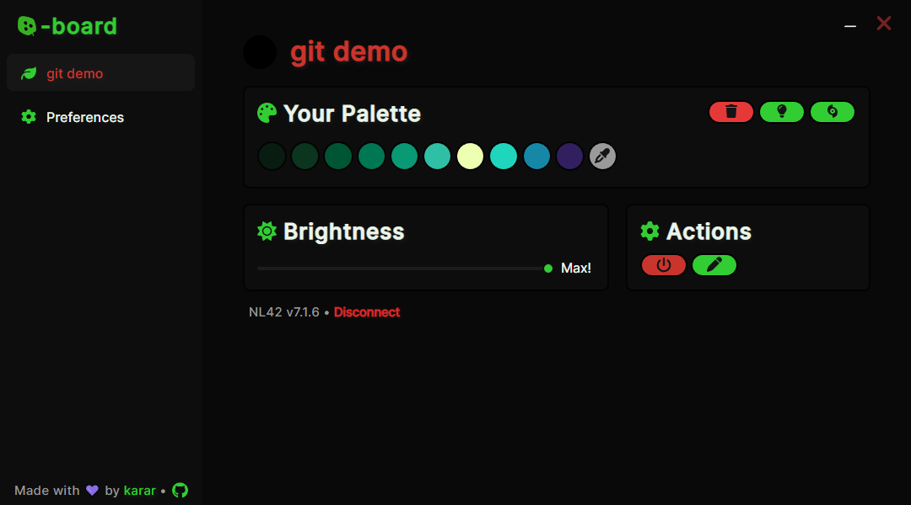
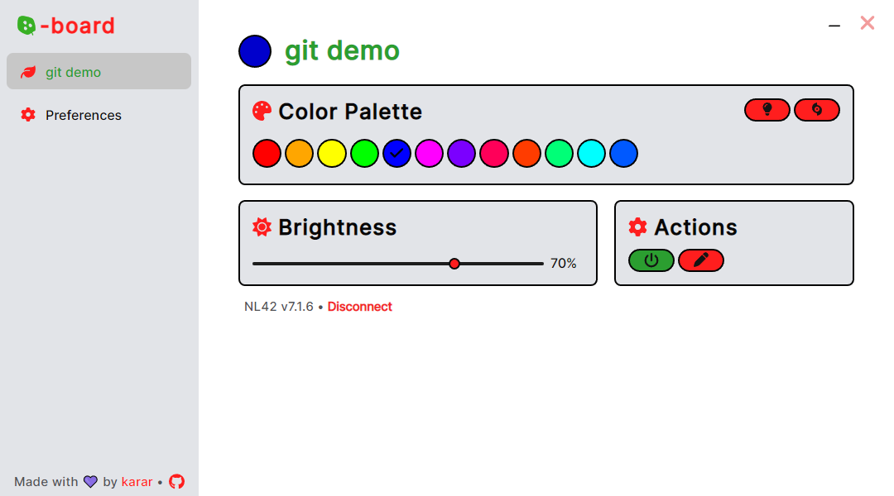
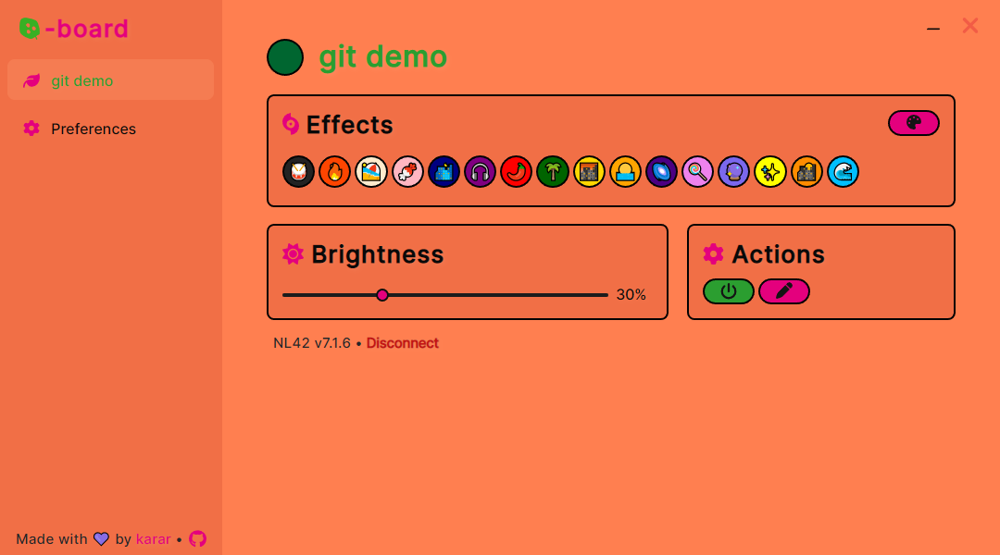
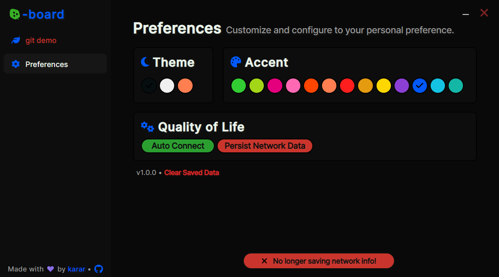

# Nanoboard
Nanoboard is a highly-personalizable desktop electron app that enables remote control of [Nanoleaf](https://nanoleaf.me/en-US/) devices. It provides a playful and creative menu interface to make changes and illuminate your room with ease.

If you encounter any problems, [create a GitHub issue](https://github.com/ka-rar/nanoboard/issues/new).

## Features
- A lightweight app enabling control of your Nanoleaf devices with ease.
- A highly-personalizable intuitive menu interface.
- Does not require a Nanoleaf account at all, works on the network.

## Prerequisites
Before getting started, ensure that you have the following dependencies installed:
- [Git](https://git-scm.com/downloads)
- [Node.js](https://nodejs.org/) (installed via Homebrew: `brew install node`)

## Installation
Follow these steps to clone and run the Nanoboard project:

1. Clone the repository:
   ```shell
   git clone https://github.com/ka-rar/nanoboard
   ```
2. Change to the project directory:
   ```shell
   cd Nanoboard
   ```
3. Install the necessary dependencies:
   ```shell
   npm install
   ```
4. Start the application:
   ```shell
   npm start
   ```

# Screenshots



